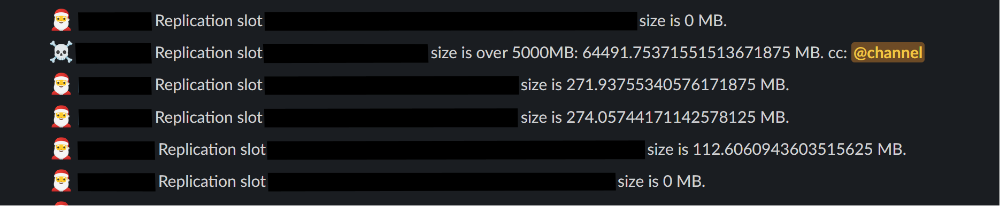

# PG Slot Notify Bot

## Introduction

`pgslot-notify-bot` is a tool designed to monitor PostgreSQL replication slots. It provides notifications if a replication slot grows beyond a specified size. This is particularly useful for database administrators and teams who need to keep an eye on replication slot sizes to prevent issues related to disk space and replication lag.

## Screenshot



## Prerequisites

Before setting up `pgslot-notify-bot`, ensure you have:

- A PostgreSQL database
- A Slack workspace for notifications

## Installation

1. **Clone the repository:**

   ```bash
   git clone git@github.com:PeerDB-io/pgslot-notify-bot.git
   cd pgslot-notify-bot
   ```

2. **Set up the environment:**

   - Copy the `.env.template` file to a new file named `.env`.

      ```bash
      cp .env.template .env
      ```

   - Fill in the values in the `.env` file with your specific settings.

3. **Running the bot:**

   - Use the provided script to start the bot.

      ```bash
      ./run.sh
      ```

## Configuration

### Environment Variables

You need to set the following environment variables in the `.env` file:

- `DEPLOYMENT_NAME`: The name of the postgres deployment to monitor.
- `SLACK_BOT_TOKEN`: Your Slack bot token.
- `SLACK_CHANNEL`: The Slack channel where notifications will be sent.
- `DB_HOST`: The host of the PostgreSQL database.
- `DB_PORT`: The port of the PostgreSQL database.
- `DB_USER`: The user for the PostgreSQL database.
- `DB_PASSWORD`: The password for the PostgreSQL database.
- `DB_NAME`: The name of the PostgreSQL database.
- `INTERVAL_SECONDS`: The interval in seconds for the bot to check the replication slot size.
- `SIZE_THRESHOLD_MB`: The size threshold in MB for the replication slot. Notifications are sent if this size is exceeded.

## Usage

Once the bot is running, it will automatically check the size of the PostgreSQL replication slots at the defined interval. If a replication slot size exceeds the specified threshold, a notification will be sent to the configured Slack channel.

## Contributing

Contributions to `pgslot-notify-bot` are welcome. Please feel free to submit pull requests or open issues to discuss proposed changes or enhancements.

## Contact

For support or queries, contact [contact@peerdb.io](mailto:contact@peerdb.io).
